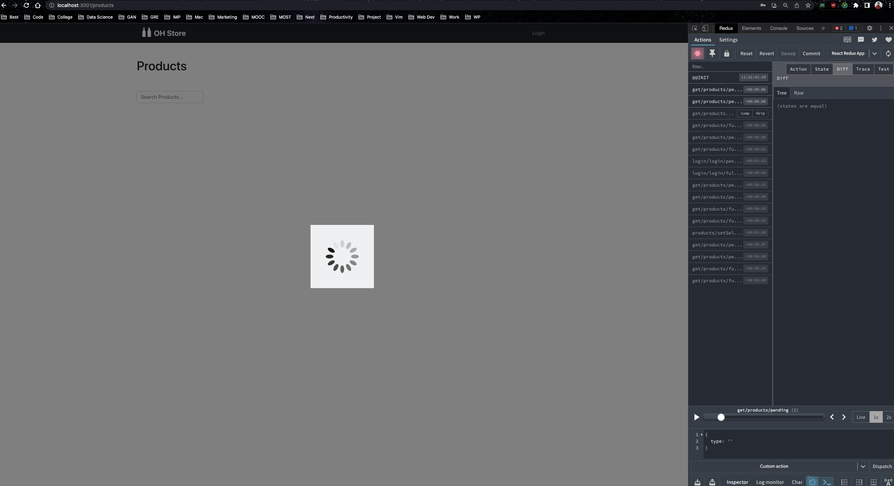

# README

## Ruby version
3.1.2

## Rails version
7.0.4

## Tech Stack

* [Ruby on Rails](http://rubyonrails.org/)
* [PostgreSQL](https://www.postgresql.org/)
* [React](https://facebook.github.io/react/)
* [Redux](http://redux.js.org/)
  
## Main Features
- [x] Search products by name using Elasticsearch
- [x] Infinite scroll for products with pagination

- [x] Token based authentication for API
- [x] XML import service for products
- [x] Active Storage for product images OR Image URL
- [x] React frontend with Redux for state management
- [x] Associations between products and categories
- [x] Associations between products and brands 
- [x] View only products that are in stock
- [x] View only access for Non-Logged in users
- [x] Add/Edit/Delete products for Admin users
- [x] Spinner for all API calls
- [x] Fetching only required data from API

## TODO
- [x] Thunk middleware for API calls(for authentication)
- [x] Pundit for authorization
- [x] Frontend tests
- [x] React app deployment
- [x] Better search results for products(autocomplete, suggestions, etc.)
- [x] Internationalization for frontend
- [x] Stopwords for Elasticsearch 

## Limitations
- [x] Could not host on Heroku due to Elasticsearch addon

## Installation
Once you have the above dependencies installed, you can install the application by running the following commands:

```bash
$ git clone
$ cd
$ bundle install
$ rake db:create
$ rake db:migrate
$ rails c > XmlImportService.call(file_name: 'db/seeds/products.rss') 
$ rails s
```

To run the react app, run the following commands:

```bash
$ cd frontend
$ yarn install
$ yarn start
```

## Importing products from rss feed

```bash
$ rake import:products
```

## Installation

* Install [Ruby](https://www.ruby-lang.org/en/documentation/installation/)
* Install [PostgreSQL](https://www.postgresql.org/download/)
* Install [Node.js](https://nodejs.org/en/download/)
* Install [Yarn](https://yarnpkg.com/en/docs/install)
* Install [Elasticsearch](https://www.elastic.co/guide/en/elasticsearch/reference/current/_installation.html)

Elasticsearch is used for full text search. 

## Running Tests

Rspec tests can be run with the following command:

```bash
$ bundle exec rspec
```

## Running Rubocop

Rubocop can be run with the following command:

```bash
$ bundle exec rubocop
```

## Screenshots



